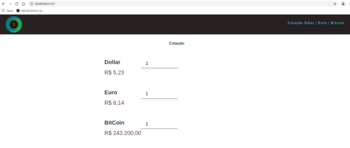

# currency-quote

This is a mini project for currency quotes of the dollar, euro, and bitcoin for currency Brazilian. It's my first project made in Vuejs, they separate the templates of the scripts and styles, cool. I loved.
The inputs get values dynamically, and the texts of the labels currency of Brazilian values too.



## Project setup
```
npm install
```

### Compiles and hot-reloads for development
```
npm run serve
```

### Compiles and minifies for production
```
npm run build
```

### Lints and fixes files
```
npm run lint
```

### Customize configuration
See [Configuration Reference](https://cli.vuejs.org/config/).

### Components
CurrentQuote.vue 
Header.vue 

### app
App.vue   
